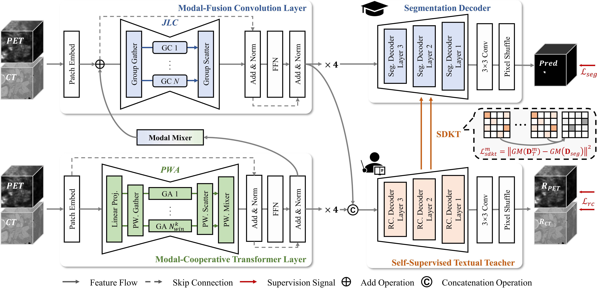
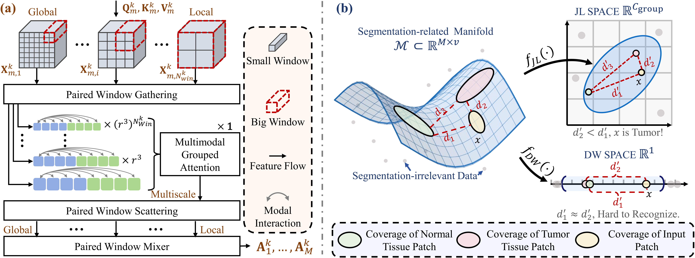
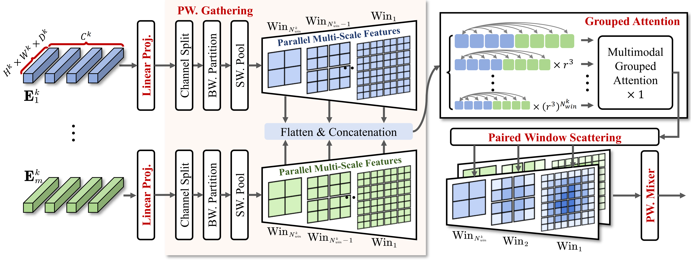

# [ICLR 2026] VeloxSeg: Johnson-Lindenstrauss Lemma Guided Network for Efficient 3D Medical Segmentation

## News / Updates

- **2026-01**: VeloxSeg is accepted by **ICLR 2026**!
- **2026-01**: We are preparing an open-source **VeloxSeg v2** with **out-of-the-box nnUNet/nnUNetv2-style auto-configuration** (dataset conversion scripts + auto-generated plans + a `VeloxSegTrainer` inheriting from `nnUNetTrainer`). See the roadmap below.

## Roadmap (VeloxSeg v2: nnUNet-style auto-configuration)

- [ ] Release a `v2` branch with nnUNet/nnUNetv2-style auto-configuration (dataset fingerprinting, auto-generated `plans` files, reproducible seeds).
- [ ] Provide dataset conversion helpers to nnUNet format (generate `dataset.json` + splits; validate spacing/orientation; optional modality handling).
- [ ] Implement a `VeloxSegTrainer` that inherits from `nnUNetTrainer`, with VeloxSeg-specific architecture/loss defaults.
- [ ] Provide one-command training examples (e.g., `nnUNetv2_plan_and_preprocess` + `nnUNetv2_train`).
- [ ] Provide pre-trained weights, inference demos, and minimal docs for end-to-end usage.

## Overview

<center>
    
    <br>
    <div style="color:orange; border-bottom: 1px solid #d9d9d9;
    display: inline-block;
    color: #999;
    padding: 2px;">Overview of VeloxSeg. VeloxSeg employs an encoder-decoder architecture with Paired Window Attention (PWA) and Johnson-Lindenstrauss lemma-guided convolution (JLC) on the left, using 1x1 convolution as modal mixer. GC: group convolution; GA: grouped attention.</div>
</center>
VeloxSeg is a lightweight multimodal medical image segmentation framework that addresses the fundamental "efficiency / robustness conflict" in 3D medical image segmentation.

## Architecture

The framework consists of three main components:

<center>
    
    <br>
    <div style="color:orange; border-bottom: 1px solid #d9d9d9;
    display: inline-block;
    color: #999;
    padding: 2px;">(a) Overview of Paired Window Attention (PWA). (b) Intuitive difference between depth-wise (DW) convolution and Johnson-Lindenstrauss guided Convolution (JLC) in the feature space.</div>
</center>

1. **Encoder** (`Encoder.py`): Dual-branch architecture
   - Modal-Fusion Convolution Layer with JLC blocks
    <center>
        
        <br>
        <div style="color:orange; border-bottom: 1px solid #d9d9d9;
        display: inline-block;
        color: #999;
        padding: 2px;">Detailed architecture of Paired Window Attention (PWA). This figure focuses on visually showing the feature flows of PWA.</div>
    </center>
   - Modal-Cooperative Transformer Layer with PWA blocks

2. **Decoder** (`Decoder.py`): Dual-decoder architecture
   - Segmentation Decoder (Student): Primary segmentation task
   - Reconstruction Decoder (Teacher): Self-supervised texture teacher

3. **Main Model** (`VeloxSeg.py`): Integrates encoder and decoder with SDKT

## File Structure

```
VeloxSeg/
├── model/
│   ├── components/          # Core components (attention, convolution blocks, etc.)
│   ├── Encoder.py           # Dual-stream encoder implementation
│   ├── Decoder.py           # Dual-decoder with SDKT
│   └── VeloxSeg.py          # Main model class
├── config/                  # Configuration files for different datasets
├── utils/                   # Training and inference utilities
├── preprocess/              # Data preprocessing scripts
├── compared_model/          # Baseline model implementations
├── run_train.py             # Training script
├── run_test.py              # Testing script
├── train.sh                 # Training commands
├── test.sh                  # Testing commands
├── Overview.pdf             # Detailed framework overview and design principles
└── requirement.txt          # Python dependencies
```

## Installation

### Environment Requirements

- Ubuntu 22.04.4 LTS
- Python 3.10.16
- CUDA 12.2
- NVIDIA GeForce RTX 3090 (or compatible GPU)

### Setup

```bash
# Create conda environment
conda create -n VeloxSeg python==3.10
conda activate VeloxSeg

# Install PyTorch
pip install torch==2.4.1 torchvision==0.19.1 torchaudio==2.4.1 --index-url https://download.pytorch.org/whl/cu118

# Install other dependencies
pip install -r requirement.txt
```

## Datasets

The framework supports multiple medical image segmentation datasets:

- **AutoPET-II**: Automated Lesion Segmentation in PET/CT Challenge
- **Hecktor2022**: MICCAI Hecktor 2022 Challenge (Head & Neck)
- **BraTS2021**: RSNA-ASNR-MICCAI Brain Tumor Segmentation Challenge 2021
- **MSD2019**: Medical Segmentation Decathlon Task-01

## Data Preprocessing

Run the preprocessing scripts before training:

```bash
# Registration
python ./preprocess/registration.py

# Intensity normalization
python ./preprocess/normalization_CT_PET.py  # For PET/CT datasets
python ./preprocess/normalization_MRI.py     # For MRI datasets
```

## Training

### Quick Start

> Note: The current `main` branch uses VeloxSeg's JSON configs (`config/*.json`). The nnUNet/nnUNetv2-style auto-configuration and `nnUNetTrainer`-based training will be shipped in **VeloxSeg v2** (see Roadmap).

```bash
# Train on AutoPET-II dataset
sh train.sh
```

### Custom Training

```bash
python run_train.py \
    --dataset_name AutoPETII \
    --model_name VeloxSeg \
    --train_config ./config/train_config_bs4.json \
    --model_config ./config/models_config_autopetii.json \
    --num_workers 4 \
    --gpu_id 0
```

### Supported Datasets

- **AutoPET-II**: `--dataset_name AutoPETII`
- **Hecktor2022**: `--dataset_name Hecktor2022`
- **BraTS2021**: `--dataset_name BraTS2021`

## Inference and Evaluation

```bash
# Run inference and evaluation
sh test.sh
```

### Custom Inference

```bash
python run_test.py \
    --dataset_name AutoPETII \
    --model_name VeloxSeg \
    --train_config ./config/train_config_bs4.json \
    --model_config ./config/models_config_autopetii.json \
    --test_config ./config/test_config.json \
    --num_workers 4 \
    --gpu_id 0 \
    --train_date 09_12 \
    --use_hd95 1
```

## Model Configuration

The model configuration files contain hyperparameters for different datasets:

- `models_config_autopetii.json`: AutoPET-II configuration
- `models_config_hecktor2022.json`: Hecktor2022 configuration  
- `models_config_brats2021.json`: BraTS2021 configuration

Key VeloxSeg parameters:

- `input_size`: Input spatial dimensions (e.g., $[96, 96, 96]$)
- `in_ch`: Input channels per modality (e.g., $[1, 1]$ for $\langle PET,CT\rangle$, $[2]$ for $PET+CT$)
- `base_ch`: Base number of channels (default: $16$)
- `kernel_sizes`: Parallel kernel sizes (default: $[1, 3, 5]$)
- `min_dim_group`: JL-guided group dimensions (default: $[4, 8, 8, 16]$)

## Performance

### Computational Efficiency

- **Parameters**: 1.66M (vs 88.62M for nnUNet)
- **FLOPs**: 1.79G (vs 3078.83G for nnUNet)
- **GPU Throughput**: 599.06 patches/s
- **CPU Throughput**: 6.67 patches/s

### Segmentation Performance

- **AutoPET-II**: 62.51% Dice (vs 48.35% for SuperLightNet)
- **Hecktor2022**: 56.48% Dice (vs 50.03% for SuperLightNet)
- **BraTS2021**: 91.44% Dice (vs 89.72% for SuperLightNet)
