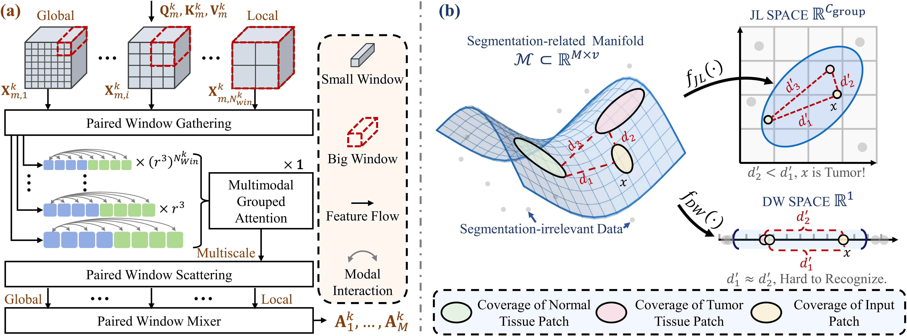
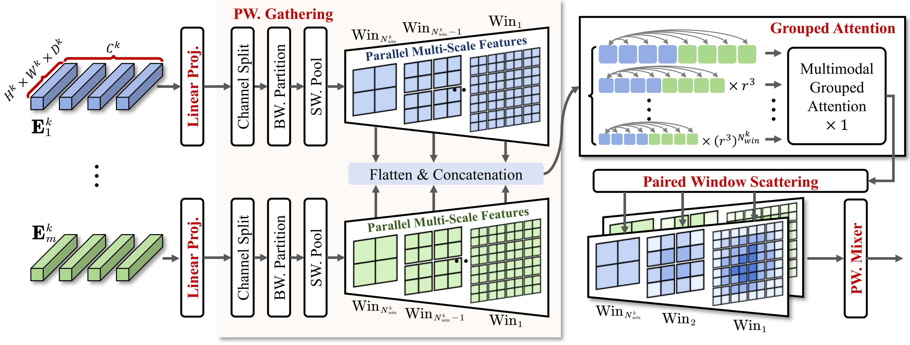

# [ICLR 2026] VeloxSeg: Johnson-Lindenstrauss Lemma Guided Network for Efficient 3D Medical Segmentation

## News / Updates

- **2026-09**: Published the completed fixed-configuration reproduction: standalone AutoPET uses summed segmentation-head losses, ±15° rotation (probability 0.5), and the trained WarmRestarts schedule. Fixed nnUNet training, inference and plans are in [nnunet/](nnunet/README.md). Automatic parameter configuration is deferred.
- **2026-01**: VeloxSeg is accepted by **ICLR 2026**!

## Overview

<center>
    
    <br>
    <div style="color:orange; border-bottom: 1px solid #d9d9d9;
    display: inline-block;
    color: #999;
    padding: 2px;">Overview of VeloxSeg. VeloxSeg employs an encoder-decoder architecture with Paired Window Attention (PWA) and Johnson-Lindenstrauss lemma-guided convolution (JLC) on the left, using 1x1 convolution as modal mixer. GC: group convolution; GA: grouped attention.</div>
</center>
VeloxSeg is a lightweight multimodal medical image segmentation framework that addresses the fundamental "efficiency / robustness conflict" in 3D medical image segmentation.

## Architecture

The framework consists of three main components:

<center>
    
    <br>
    <div style="color:orange; border-bottom: 1px solid #d9d9d9;
    display: inline-block;
    color: #999;
    padding: 2px;">(a) Overview of Paired Window Attention (PWA). (b) Intuitive difference between depth-wise (DW) convolution and Johnson-Lindenstrauss guided Convolution (JLC) in the feature space.</div>
</center>

1. **Encoder** (`Encoder.py`): Dual-branch architecture
   - Modal-Fusion Convolution Layer with JLC blocks
    <center>
        
        <br>
        <div style="color:orange; border-bottom: 1px solid #d9d9d9;
        display: inline-block;
        color: #999;
        padding: 2px;">Detailed architecture of Paired Window Attention (PWA). This figure focuses on visually showing the feature flows of PWA.</div>
    </center>
   - Modal-Cooperative Transformer Layer with PWA blocks

2. **Decoder** (`Decoder.py`): Dual-decoder architecture
   - Segmentation Decoder (Student): Primary segmentation task
   - Reconstruction Decoder (Teacher): Self-supervised texture teacher

3. **Main Model** (`VeloxSeg.py`): Integrates encoder and decoder with SDKT

## File Structure

```
VeloxSeg/
├── model/
│   ├── components/          # Core components (attention, convolution blocks, etc.)
│   ├── Encoder.py           # Dual-stream encoder implementation
│   ├── Decoder.py           # Dual-decoder with SDKT
│   └── VeloxSeg.py          # Main model class
├── config/                  # Configuration files for different datasets
├── utils/                   # Training and inference utilities
├── preprocess/              # Data preprocessing scripts
├── compared_model/          # Baseline model implementations
├── run_train.py             # Training script
├── run_test.py              # Testing script
├── train.sh                 # Training commands
├── test.sh                  # Testing commands
├── fig/                     # Method and overview figures
└── requirements.txt         # Python dependencies
```

## Installation

### Environment Requirements

- Ubuntu 22.04.4 LTS
- Python 3.10.16
- CUDA-capable runtime. The completed reproduction used PyTorch 2.6.0 with CUDA 12.4; install a compatible driver and wheel.
- NVIDIA GeForce RTX 3090 (or compatible GPU)

### Setup

```bash
# Create conda environment
conda create -n VeloxSeg python==3.10
conda activate VeloxSeg

# Install PyTorch
pip install torch==2.6.0 torchvision==0.21.0 torchaudio==2.6.0 --index-url https://download.pytorch.org/whl/cu124

# Install other dependencies
pip install -r requirements.txt
```

`requirement.txt` is kept as a legacy alias for `requirements.txt`.

## Datasets

The public training and inference entrypoints currently support:

- **AutoPET-II**: Automated Lesion Segmentation in PET/CT Challenge
- **Hecktor2022**: MICCAI Hecktor 2022 Challenge (Head & Neck)
- **BraTS2021**: RSNA-ASNR-MICCAI Brain Tumor Segmentation Challenge 2021

`config/train_config_bs4.json` also contains MSD2019 path placeholders, but MSD2019 is not wired into `run_train.py` or `run_test.py` yet.

## Data Preprocessing

Run the preprocessing scripts before training:

```bash
# Registration
python ./preprocess/registration.py

# Intensity normalization
python ./preprocess/normalization_CT_PET.py  # For PET/CT datasets
python ./preprocess/normalization_MRI.py     # For MRI datasets
```

## Training

### Quick Start

> The default branch is `master`. Root entrypoints use the standalone JSON configuration. For the completed nnUNet reproduction, use the separate [fixed nnUNet instructions](nnunet/README.md).

```bash
# Train on AutoPET-II dataset
sh train.sh

# Or choose another supported dataset
DATASET_NAME=BraTS2021 GPU_ID=0 sh train.sh
```

### Custom Training

`config/train_config_bs4.json` is the historical filename; the actual batch size is **2**, with two sampled patches per case. The completed AutoPET run used 300 epochs, seed 12345, sorted 608/203/203 train/validation/test cases, and ±15° rotation with probability 0.5 (bilinear images, nearest-neighbor labels).

VeloxSeg sums CE + Dice across its four full-resolution segmentation heads, then adds `0.5 × reconstruction MSE + 2 × mean teacher Gram MSE`. `deep_Loss_weight` controls the compared models' weighted losses, not VeloxSeg's sum. AdamW uses LR 0.00025 and weight decay 0.01; the retained scheduler is 10 warmup steps followed by WarmRestarts with T0=300. Its historical constructor order makes epoch 1 use 0.00025 and epoch 11 use 0.000275; the 300-epoch run takes 290 cosine steps without a restart. These details are retained to match the completed run.

```bash
python run_train.py \
    --dataset_name AutoPETII \
    --model_name VeloxSeg \
    --train_config ./config/train_config_bs4.json \
    --model_config ./config/models_config_autopetii.json \
    --num_workers 4 \
    --gpu_id 0
```

### Supported Datasets

- **AutoPET-II**: `--dataset_name AutoPETII`
- **Hecktor2022**: `--dataset_name Hecktor2022`
- **BraTS2021**: `--dataset_name BraTS2021`

## Inference and Evaluation

```bash
# Run inference and evaluation
sh test.sh

# Override checkpoint date or dataset when needed
TRAIN_DATE=09_12 DATASET_NAME=Hecktor2022 sh test.sh
```

### Custom Inference

```bash
python run_test.py \
    --dataset_name AutoPETII \
    --model_name VeloxSeg \
    --train_config ./config/train_config_bs4.json \
    --model_config ./config/models_config_autopetii.json \
    --test_config ./config/test_config.json \
    --num_workers 4 \
    --gpu_id 0 \
    --train_date 09_12 \
    --use_hd95 1
```

## Model Configuration

The model configuration files contain hyperparameters for different datasets:

- `models_config_autopetii.json`: AutoPET-II configuration
- `models_config_hecktor2022.json`: Hecktor2022 configuration  
- `models_config_brats2021.json`: BraTS2021 configuration

Key VeloxSeg parameters:

- `input_size`: Input spatial dimensions (e.g., $[96, 96, 96]$)
- `in_ch`: Input channels per modality (e.g., $[1, 1]$ for $\langle PET,CT\rangle$, $[2]$ for $PET+CT$)
- `base_ch`: Base number of channels (default: $16$)
- `kernel_sizes`: Parallel kernel sizes (default: $[1, 3, 5]$)
- `min_dim_group`: JL-guided group dimensions (default: $[4, 8, 8, 16]$)

## Performance

### Paper-reported computational efficiency

- **Parameters**: 1.66M (vs 88.62M for nnUNet)
- **FLOPs**: 1.79G (vs 3078.83G for nnUNet)
- **GPU Throughput**: 599.06 patches/s
- **CPU Throughput**: 6.67 patches/s

### Segmentation results

| Pipeline / test metric | September 2026 reproduction |
|---|---:|
| Standalone AutoPET, 102 positive cases among 203 test cases | 62.1966% Dice |
| Fixed nnUNet AutoPET, the same 102 positive cases | 69.8790% Dice |
| Fixed nnUNet BraTS, 251 cases, native whole-volume WT/TC/ET mean | 81.0976% Dice |

The standalone AutoPET result uses the best validation checkpoint (epoch 265), FP32 sliding-window inference, 25% overlap, patch batch 2, and no TTA. The nnUNet results use the final epoch-1000 checkpoint and native TTA. On the 101 common negative AutoPET cases, standalone and nnUNet predict foreground in 42 and 101 cases respectively; positive-only Dice does not describe negative-case performance.

Paper-reported results were AutoPET 62.51%, Hecktor 56.48%, and BraTS 91.44%. The precise AutoPET 62.51% checkpoint is not yet identified. BraTS 91.44% used a legacy slice-averaged evaluator with a TC label mismatch; the new predictions score 91.32% with that same legacy evaluator, versus 81.10% with the corrected native whole-volume evaluator. See [evaluation definitions and the fixed nnUNet protocol](nnunet/README.md). The root standalone BraTS metric now also reduces all three spatial axes; its labels retain the separate standalone convention (`4→3`, TC `{1,3}`).
