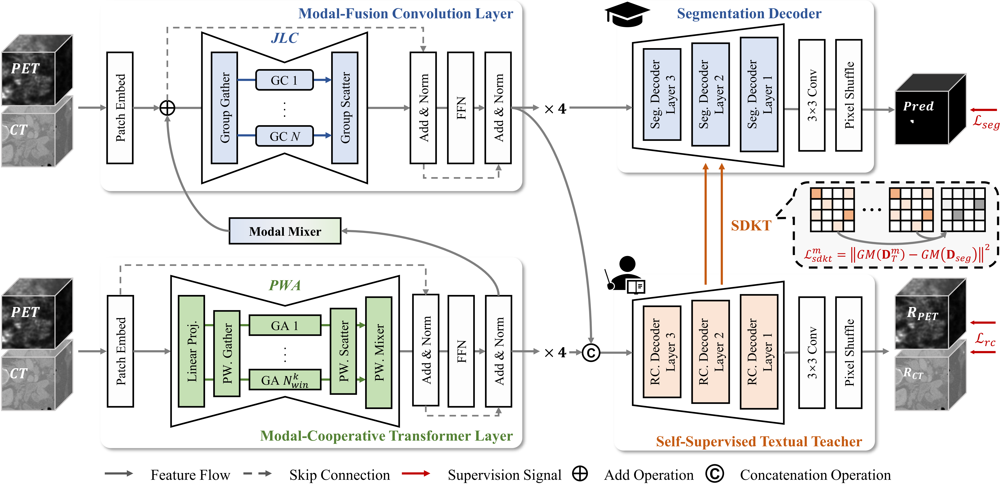

# [ICLR 2026] VeloxSeg: Johnson-Lindenstrauss Lemma Guided Network for Efficient 3D Medical Segmentation

## News / Updates

- **2026-09**: The **nnVeloxSeg** branch adds native nnU-Net v2 training and automatic S/B/L configurations for AutoPET-II, BraTS2021 and Hecktor2022.
- **2026-01**: VeloxSeg is accepted by **ICLR 2026**!

## Overview

VeloxSeg is a lightweight multimodal 3D medical image segmentation network.
It combines Johnson-Lindenstrauss guided convolution (JLC), Paired Window
Attention (PWA), and reconstruction-based knowledge transfer.



This branch integrates VeloxSeg with nnU-Net v2 preprocessing, augmentation,
training, checkpoints and sliding-window inference. S/B/L start at **8/16/24
channels** and share one automatically planned patch per dataset. The default
training batch is **8**, with a **24 GiB** planning target.

The original standalone implementation and reported paper results are available
on [master](https://github.com/JinPLu/VeloxSeg/tree/master). This branch uses a
new stage-based architecture; historical checkpoints are incompatible.

## Installation

Use a dedicated Python 3.11 environment with a CUDA-compatible PyTorch installation.
The checked environment uses PyTorch 2.6.0 and nnUNetv2 2.6.2.

```bash
git clone -b nnVeloxSeg https://github.com/JinPLu/VeloxSeg.git
cd VeloxSeg
python -m pip install -r nnunet/requirements.txt
python nnunet/install.py

export nnUNet_raw=/path/to/nnUNet_raw
export nnUNet_preprocessed=/path/to/nnUNet_preprocessed
export nnUNet_results=/path/to/nnUNet_results
export nnUNet_compile=false
```

## Datasets

Prepare images and labels in nnU-Net format. Bundled metadata and folds are in
[nnunet/config](nnunet/config/); use these folds only with matching case IDs.

| Dataset | ID | Channel order | Shared S/B/L patch |
|---|---:|---|---|
| BraTS2021 | 137 | T1, T1ce, T2, FLAIR | 160×192×160 |
| AutoPET-II | 221 | PET, CT | 160×224×224 |
| Hecktor2022 | 990 | PET, CT | 160×256×256 |

Patches are generated from the supplied fingerprints and memory target.
Your dataset may produce a different configuration.

## Training

```bash
# Generate S/B/L plans and preprocess once (the tiers share a cache).
nnUNetv2_plan_and_preprocess -d 990 -pl VeloxSegPlanner -c 3d_fullres_B -gpu_memory_target 24

# Train B on fold 4. Replace B with S or L to choose another size.
nnUNetv2_train 990 3d_fullres_B 4 -tr nnVeloxSegTrainer -p nnVeloxSegPlans -num_gpus 1
```

Add `--c` to resume an existing run. For training followed by held-out test
prediction and evaluation, use `bash nnunet/scripts/run_experiment.sh 990 B`.
See the [experiment guide](nnunet/EXPERIMENTS.md) for six BraTS/AutoPET runs
and the five Hecktor reference/auto configurations.

## Inference and Evaluation

```bash
nnUNetv2_predict -i /path/to/imagesTs -o /path/to/predictions \
  -d 990 -c 3d_fullres_B -f 4 -tr nnVeloxSegTrainer \
  -p nnVeloxSegPlans -chk checkpoint_final.pth
```

The [training-and-test script](nnunet/scripts/run_experiment.sh) also evaluates
predictions against `labelsTs` and writes `test_summary.json`.

## Validation

BraTS, AutoPET and Hecktor S/B/L passed RTX3090 checks with real data, full planned
patches and batch8: short training, validation, checkpoint resume and whole-case
prediction. Long-run convergence and segmentation accuracy remain unverified;
pretrained weights for this branch are not yet available.

See [usage](nnunet/README.md) and [planning rules and measured evidence](nnunet/RULES.md)
for the training objective, resource estimates and benchmark limitations.
